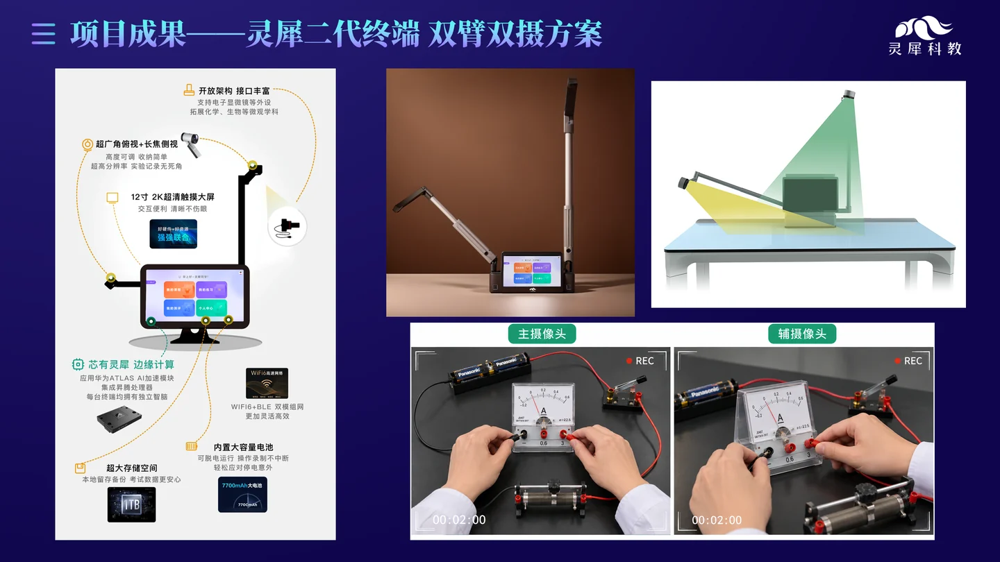
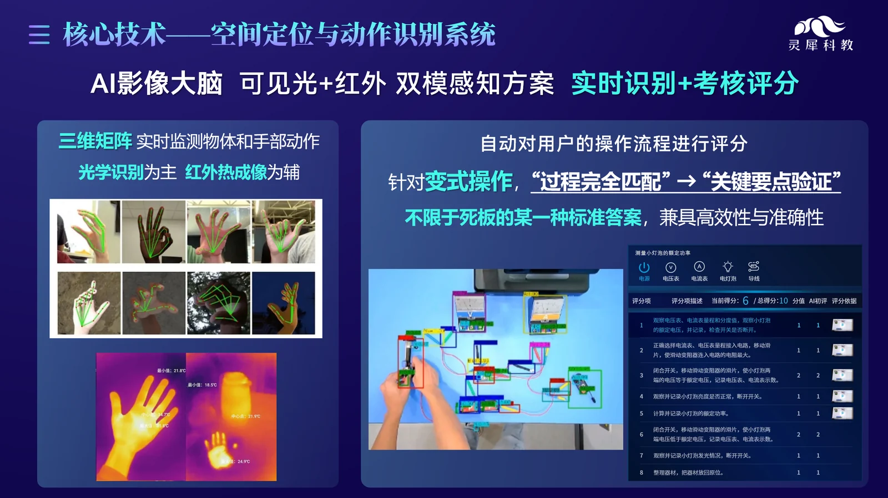
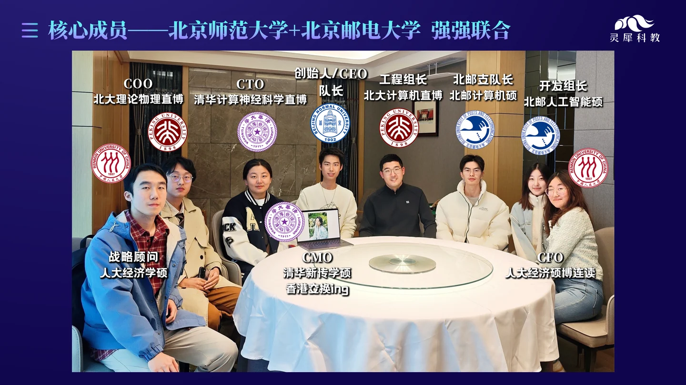
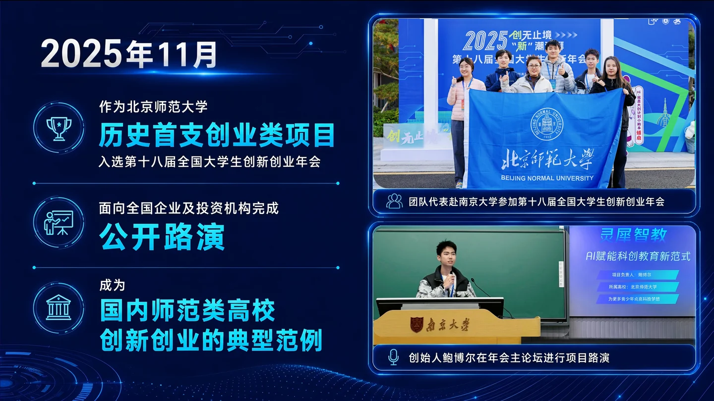
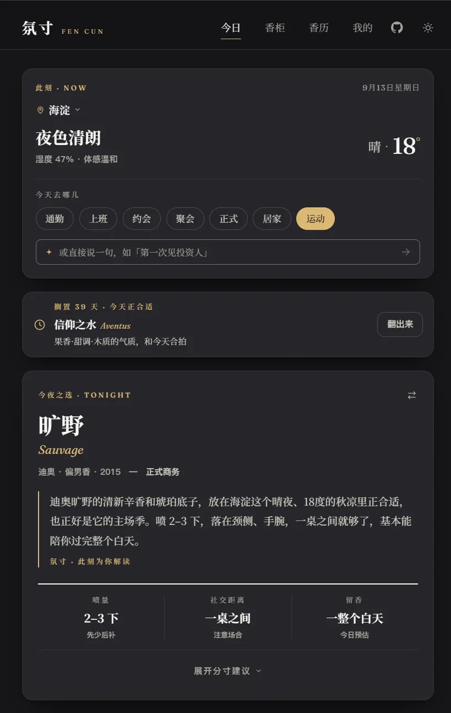
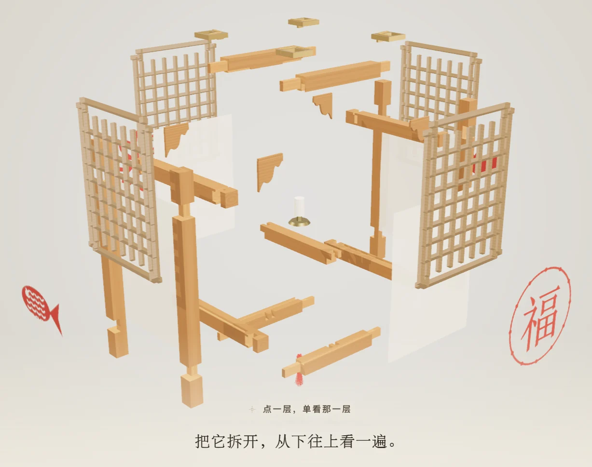
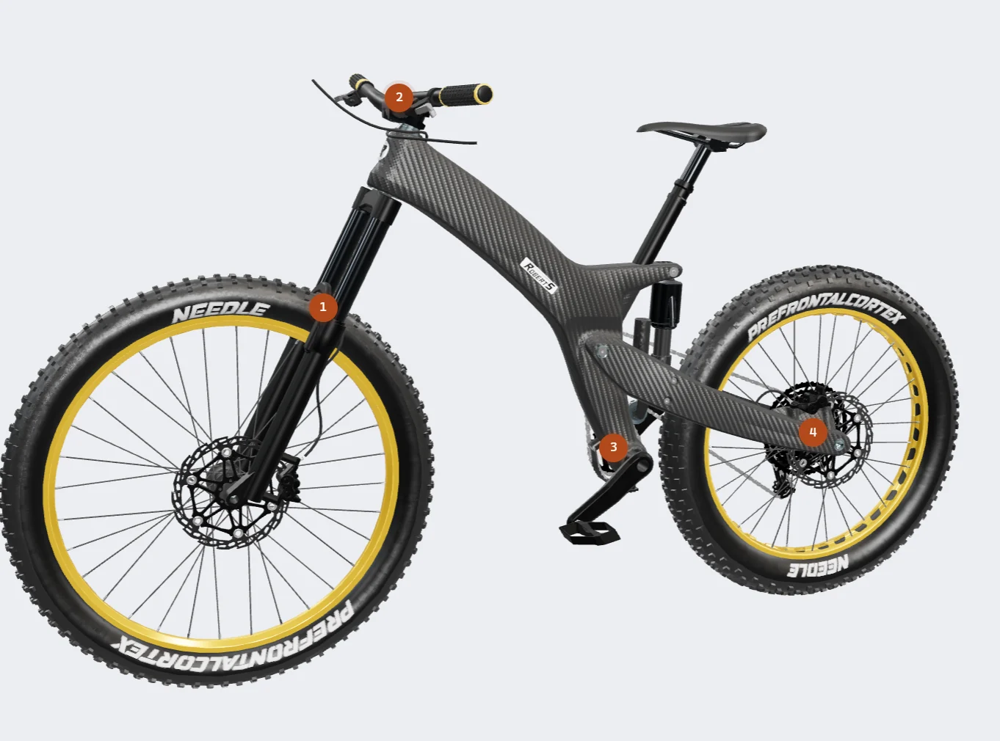
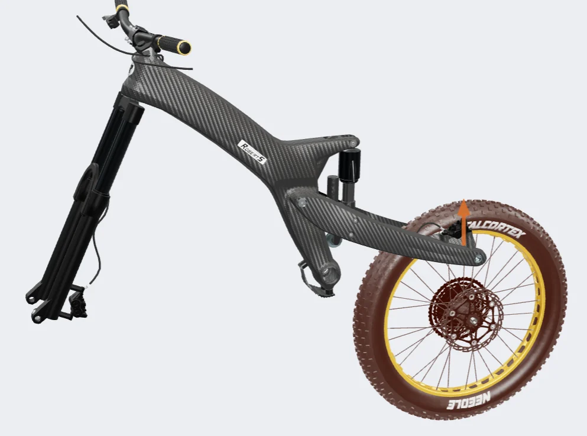

<h1>鲍博尔</h1>

北京师范大学 本硕 ｜ 影视传媒 × AIGC 方向 ｜ 28 届研二

AI + 科创教育 0→1 创业者 ｜ AI 独立开发者

<strong>懂内容、懂用户、懂增长，擅长用 AI 把 idea 快速做成看得见的产品</strong>

<strong>随时到岗 ｜ 每周 5 天 ｜ 可实习 6 个月</strong>

---

## 教育背景

| 学校 | 专业 | 学历 | 时间 |
|:--|:--|:--|:--|
| 北京师范大学 | 艺术学（AIGC 方向） | 硕士在读 | 2025.09 – 2028.06 |
| 北京师范大学 | 影视传媒（双一流 A+ 学科） | 本科 | 2021.09 – 2025.06 |

| 综合成绩 | GPA | 学业排名 | 四六级 |
|:--:|:--:|:--:|:--:|
| 91.18 / 100 | 3.84 / 4.0 | 1 / 34 | 598 / 561 |

### 核心课程

AIGC 应用、产品设计、统计学、传媒经济学、品牌营销、新媒体研究、大众传播学、视频编导制作

### 荣誉奖项

**北京市优秀毕业生**、**小米特等奖学金**、**京师校友金声奖学金**

校级三好学生、优秀学生干部、优秀共青团员等，共获得校级及以上奖励 40 余项

---

## 创业经历

## 灵犀智教 · AI 赋能青少年科创实验教学解决方案

**创始人 / CEO**　｜　2023.09 – 2026.03

### 项目定位

面向中考理化生实验考试场景，针对“教学反馈不及时、评分标准不客观、操作过程难追溯”三大痛点

主导设计“AI 视觉识别 + 智能教学硬件 + 实验课程内容”一体化解决方案

### 核心工作

从 0 到 1 完成需求拆解、竞品调研、产品功能规划、商业模式设计、路演材料与对外合作沟通

组建并带领北京师范大学 + 北京邮电大学两校教育学、计算机、商科等跨学科成员 30 余人

推动项目从概念方案进入创业孵化与竞赛验证阶段

### 竞赛成果

- 第九届中国国际 **“互联网+”** 大学生创新创业大赛  北京赛区一等奖
- 中国国际大学生创新大赛（2024）  北京赛区一等奖
- 2024年 **“挑战杯”** 全国大学生创业计划竞赛  北京赛区银奖
- 第十七届 iCAN 大学生创新创业大赛  全国总决赛二等奖、北京赛区一等奖
- 第二届、第三届 “京彩大创” 北京大学生创新创业大赛  百强创业团队

### 项目成果

- 教育部第十八届全国大学生创新年会「创业推介项目」全国前 60 强，北师大历史首次入选

- 2024 年度国家级大学生创业计划项目「优秀结项」，已入驻北京高校大学生创业园（理工园）

- 作为第一发明人，已申请国家发明专利、实用新型专利 2 项

---

## 实践经历

## 薪跳 · PayDance

**Vibe Coding 独立产品开发者**　｜　2026.05 – 2026.08

  
  
  

### 需求洞察

捕捉到年轻职场用户对“工作时间—工资回报”实时感知的情绪需求

借助 Codex 和 Claude Code 独立开发了一款轻量优雅的「实时工资」小软件

根据用户的薪资和上下班时间动态计算每一秒的收入增长，让劳动时间价值可视化

### 产品实现

项目基于 Tauri 2 + Vue 3 构建

网页版全面适配 PC 端与移动端，桌面版提供迷你悬浮窗，支持随时查看“已经挣了多少钱”。

### 发布增长

独立完成[产品官网](https://paydance.vercel.app/)部署、CI / CD 工作流搭建与 [Product Hunt](https://www.producthunt.com/products/paydance) 首发

GitHub 下载量 **1800+** 次、**55** Stars，获[抖音精选 AI 博主推荐](https://v.douyin.com/LAk1Ufx1cx4/)，已申请软件著作权

跑通“需求洞察—功能设计—开发测试—发布增长”的完整闭环

---

## 氛寸 · FenCun

**AI Agent 独立产品开发者**　｜　2026.07 – 2026.09

  
  

### 需求洞察

一个基于实时天气×出席场合的「香水决策」Agent，告诉你今天最适合喷哪瓶香水、怎样用得恰到好处

### 产品实现

基于 Next.js + React + TypeScript 构建，已上线[产品官网](https://fencun.vercel.app)

从用户的香柜里给出今天喷哪瓶、喷多少、喷在哪、能留多久

### 工程思路

决策权给规则引擎，表达权给大模型

打分、喷量与裁决全部由确定性规则计算，可解释、可复现、可降级

DeepSeek 负责解析自然语言场景与生成话术，输出经 schema 校验与数字白名单把关

---

## 北京一童视界教育科技有限公司

**产品运营实习生**　｜　2026.02 – 2026.08

### 卖点转译

负责“StepFlow 交互式 3D 协同创作平台”的产品运营与卖点转译

结合市场调研与竞品分析，梳理目标用户、使用场景与差异化卖点

将 3D 协同创作、分步骤交互展示等复杂技术能力转化为客户易理解、可感知的产品表达

### 流程重构

主动引入 AIGC 重构内容生产流程，独立开发[可运行 Demo](https://github.com/MrBaoboer/SunMao-Lantern) 32 套

具象化呈现方案效果、明确交互逻辑，指导研发团队落地实现

### 业务拓展

识别到产品在电商场景中的应用潜力，提出“[3D 装配说明书](https://github.com/MrBaoboer/3D-Bike-Builder)”转型方案，推动形成新的业务方向。

---

## 网易传媒科技（北京）有限公司

**内容运营实习生**　｜　2022.06 – 2022.09

### 账号运营

负责“网易知识公路”旗下“[庖丁解万物](https://www.bilibili.com/video/BV18N4y1F7oR)”“[三维地图看世界](https://www.bilibili.com/video/BV1x24y1o7m6/)”知识类短视频账号的运营

独立完成选题策划、脚本撰写、剪辑制作、发布复盘全流程

### 数据迭代

基于时事热点、播放数据与用户反馈，持续迭代标题、选题与叙事节奏，提升内容点击与传播效率

[单条作品](https://www.capcut.cn/share/7412276963986969880)全网最高播放量 1000 万+，拉动账号粉丝增长 20%

---

## 人民网股份有限公司

**海外策划运营实习生**　｜　2022.09 – 2022.12

### 策划宣发

负责文化和旅游部“[中意文化和旅游年 · 美食交流活动](https://en.chinaculture.org/special_reports/62de49e6a310fd2b29e6e400)”的内容策划与海外宣发

协调各地文旅部门与采编团队，完成选题策划、脚本撰写、拍摄制作

### 传播成果

[相关作品](https://www.youtube.com/watch?v=XWriuzwCP5A)获中国驻意大利大使馆、文旅部国际交流与合作局等官方账号转载

并在 YouTube、Facebook、X 等海外社媒平台广泛传播

## 专业技能

| 类别 | 工具 |
|:--|:--|
| AI 工具 | Codex、Claude Code |
| 数据 | MySQL、Excel、SPSS |
| 产品 | Figma、Xmind |
| 内容 | PR、PS、剪映、Canva |

## 开源作品

| 项目 | 一句话 | 在线体验 |
|:--|:--|:--|
| [薪跳 PayDance](https://github.com/MrBaoboer/PayDance) | 桌面实时工资看板 · Tauri 2 + Vue 3 | [paydance.vercel.app](https://paydance.vercel.app) |
| [氛寸 FenCun](https://github.com/MrBaoboer/FenCun) | 用香决策 Agent · Next.js + DeepSeek | [fencun.vercel.app](https://fencun.vercel.app) |
| [榫卯灯笼 SunMao-Lantern](https://github.com/MrBaoboer/SunMao-Lantern) | 3D 分步交互木工课 · Three.js | [sunmao.vercel.app](https://sunmao.vercel.app) |
| [山地车组装指南 3D-Bike-Builder](https://github.com/MrBaoboer/3D-Bike-Builder) | 3D 分步交互说明书 · Three.js | [build‑bike.vercel.app](https://build-bike.vercel.app) |
