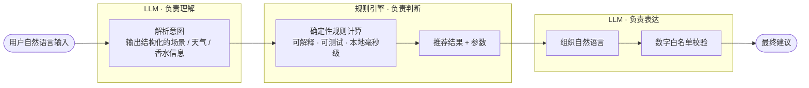

<!-- 可选：在这里放头像或 banner。GitHub 头像可直接引用： -->

# 鲍博尔 · Baoboer

**AI Native 产品探索者 · 独立开发者**

AI-native product builder · Indie developer · Media × AIGC @ Beijing Normal University

北京师范大学 影视传媒本科 → 艺术学 / AIGC 硕士 · 2028 届

 

 

🟢 **正在寻找 AI 产品 / AI Native 产品方向实习** &nbsp;·&nbsp; 可随时到岗 &nbsp;·&nbsp; 每周 5 天 &nbsp;·&nbsp; 可连续实习 6 个月

[About](#-about-me) · [Products](#-featured-products) · [Startup](#-entrepreneurship) · [Experience](#-experience) · [Education](#-education) · [Stack](#-tech--tools) · [Exploring](#-what-im-exploring) · [Contact](#-lets-connect)

---

## 👋 About Me

- 🎯 **关注什么**：AI 如何真正进入产品、工作流与真实生活场景——而不是停留在 Demo 和 PPT 里。
- 🛠️ **怎么做事**：从网易、人民网的内容运营，到带领 30+ 人跨校团队把 AI 教育项目从 0 做到 1，再到用 **Codex / Claude Code** 独立完成两款产品的设计、开发、测试、部署与增长，我一直在走同一条路径：
  > **找到真实需求 → 做出最小可用产品 → 推向真实用户 → 用反馈继续迭代**
- 🧭 **站在哪里**：我不是传统意义上的纯开发者，也不想只停留在 PRD 和原型层。我更擅长站在 **产品 × 用户 × 内容 × AI × 工程实现** 的交叉点，把一个模糊的 idea 快速变成真正可以体验、验证和传播的产品。

## ⚡ At a Glance

| 🚀 独立产品 | 🧠 0 → 1 创业 | 📈 内容增长 | 👥 团队 |
| :---: | :---: | :---: | :---: |
| **2 款上线** PayDance 1600+ 下载 · 50+ Stars | **国家级创业项目** 全国大学生创新年会 Top 60 | **单条 1000 万+ 播放** 带动账号粉丝 +20% | **30+ 人跨学科团队** 北师大 × 北邮 |

---

## 🚀 Featured Products

> 两款从 0 到上线的独立产品：需求洞察、产品设计、AI Coding、测试、发布、增长，全部独立完成。

### 01 · 薪跳 PayDance

> **让每一秒的收入增长都看得见。**

<!-- 建议在这里放一张产品截图或 GIF： -->

**实时工资小工具 · Vibe Coding 独立产品 · 2026.05 – 2026.08**

输入薪资和上下班时间，PayDance 会实时计算你今天已经挣到的钱，让抽象的劳动时间变成一个持续增长、可以被感知的数字。它捕捉的是年轻职场用户对「**我的工作时间究竟值多少钱**」的情绪需求。

传统工资工具解决的是「计算」，PayDance 想解决的是「**感知**」——它不是复杂的薪资管理系统，而是一个极简、持续存在的小工具。

**Highlights**

- 💰 实时显示「今天已经挣了多少钱」
- 🖥️ Windows 桌面端支持置顶迷你悬浮窗
- 📱 Web 端适配 PC 与移动端
- 🔒 Local-first，用户数据不上传服务器
- ⚡ 从产品设计、开发测试到发布增长全部独立完成

**Result**

- 📦 GitHub 下载量 **1600+** · ⭐ Stars **50+**
- 📣 获抖音精选 AI 博主推荐
- 🚀 独立完成官网、CI/CD、桌面端 Release 与 Product Hunt 首发
- 📜 已申请软件著作权
- 🔁 跑通完整的 **需求洞察 → 产品设计 → AI Coding → 测试 → 发布 → 增长** 闭环

**→** [在线体验](https://paydance.vercel.app/) · [GitHub Repo](https://github.com/MrBaoboer/PayDance) · [Product Hunt](https://www.producthunt.com/products/paydance) · [抖音推荐](https://v.douyin.com/LAk1Ufx1cx4/)

### 02 · 氛寸 FenCun

> **别人帮你挑香水，氛寸帮你用好香水。**

<!-- 建议在这里放一张产品截图或 GIF： -->

**用香决策 Agent · 2026**

站在香柜前，用户真正缺的往往不是更多香水推荐，而是一个每天都会发生的小判断：**今天到底该喷哪一瓶？喷多少？喷在哪里？**

氛寸从用户已经拥有的香水出发，结合 **实时天气、场合、穿着与个人偏好**，给出具体可执行的建议：

> 喷哪瓶 · 喷多少 · 喷在哪 · 能留多久 · 为什么

**Product Principles**

| 原则 | 意味着什么 |
| :-- | :-- |
| **不做导购** | 不推荐用户继续买香水，只帮用户把手里的香水真正用起来 |
| **拒绝伪精确** | 没有可靠依据时只给合理区间与档位，不制造虚假的精确数字 |
| **允许明确拒绝** | 如果一瓶香水真的不适合今天的天气或场合，产品会直接说：「今天不建议喷这瓶。」 |

**AI Architecture · 把「决策权」和「表达权」拆开**

- **规则引擎负责判断**：可解释、可测试、本地毫秒级计算
- **LLM 负责理解与表达**：不负责凭空生成核心参数
- **数字白名单校验**：避免模型改写关键数字
- **Fallback 机制**：模型超时或异常时仍可返回基础建议
- **反馈学习**：用户评价形成单瓶级个性化偏移
- **香历系统**：自动记录每天实际使用情况

> 这是我对「**AI 不应该替代确定性逻辑，而应该出现在最适合它的位置**」的一次产品实践。

**→** [在线体验](https://fencun.vercel.app) · [GitHub Repo](https://github.com/MrBaoboer/FenCun) · [完整产品方案](https://github.com/MrBaoboer/FenCun/blob/main/docs/%E6%B0%9B%E5%AF%B8-%E4%BA%A7%E5%93%81%E6%96%B9%E6%A1%88.md)

### 🧩 More Builds

| 项目 | 简介 | 背景 |
| :-- | :-- | :-- |
| 🏮 [SunMao-Lantern](https://github.com/MrBaoboer/SunMao-Lantern) | 木工课程：用交互式 3D 学习制作一盏榫卯灯笼 | StepFlow 平台 Demo · 一童视界实习期间 |
| 🚲 [3D-Bike-Builder](https://github.com/MrBaoboer/3D-Bike-Builder) | 数字化说明书：交互式完成一台山地自行车的组装 | StepFlow 平台 Demo · 一童视界实习期间 |

---

## 🧠 Entrepreneurship

### 灵犀智教 · 从 0 到 1

**AI 赋能青少年科创实验教学解决方案 · Founder / CEO · 2023.09 – 2026.03**

面向中考理化生实验教学与考试场景，我发起并主导设计了 **AI 视觉识别 + 智能教学硬件 + 实验课程内容** 的一体化解决方案，聚焦三个真实的教学问题：

- 教学反馈不及时
- 实验评分标准主观
- 学生操作过程难追溯

**What I Did**

`用户需求` → `竞品调研` → `产品定义` → `功能规划` → `商业模式` → `团队搭建` → `产品验证` → `创业孵化`

- 从 0 组建 **北京师范大学 × 北京邮电大学 30+ 人跨学科团队**，覆盖教育学、计算机、商科等专业
- 主导需求拆解、竞品研究、产品规划与商业模式设计
- 负责项目路演、合作沟通与创业竞赛
- 以第一发明人申请 **国家发明专利 / 实用新型专利 2 项**

**Milestones**

| 🏆 荣誉 | 成绩 |
| :-- | :-- |
| 教育部第十八届全国大学生创新年会 | 入选「创业推介项目」全国前 60 强 · **北京师范大学历史首次** |
| 国家级大学生创业训练计划 | 2024 年度国家级项目 · 获评「优秀结项」· 入驻北京高校大学生创业园（理工园） |
| 中国国际「互联网+」大学生创新创业大赛 | 北京赛区一等奖 |
| iCAN 大学生创新创业大赛 | 全国总决赛二等奖 · 北京赛区一等奖 |
| 「挑战杯」全国大学生创业计划竞赛 | 北京赛区银奖 |

---

## 💼 Experience

| 时间 | 公司 · 岗位 | 一句话概括 |
| :-- | :-- | :-- |
| 2026.02 – 2026.08 | **一童视界** · 产品运营实习生 | 负责 StepFlow 3D 协同创作平台运营，用 AIGC 独立开发 **32 套可运行 Demo**，提出「3D 装配说明书」转型方向 |
| 2022.09 – 2022.12 | **人民网** · 策划运营实习生 | 「中意文化和旅游年」美食交流活动内容策划与海外传播，作品获使馆与文旅部官方账号转载 |
| 2022.06 – 2022.09 | **网易传媒** · 内容运营实习生 | 知识类短视频账号运营，单条 **1000 万+** 播放，带动账号粉丝增长 **20%** |

<b>一童视界 · 产品运营实习生</b>（2026.02 – 2026.08）

 

北京一童视界教育科技有限公司。负责 **StepFlow 交互式 3D 协同创作平台** 的产品运营、场景探索与产品卖点转译。

面对 3D 协同创作、分步骤交互等较难被客户直接理解的技术能力，我用「**可直接体验的 Demo**」代替传统 PPT 描述：

- 结合市场调研、竞品分析梳理目标用户与使用场景
- 将复杂技术能力转化为客户可理解、可感知的产品表达
- 主动引入 AIGC 重构 Demo 制作流程，**独立开发 32 套可运行 Demo**
- 用 Demo 明确产品交互逻辑，辅助研发团队落地
- 识别到 StepFlow 在电商售后与商品说明场景中的潜力，提出 **「3D 装配说明书」** 产品转型方向，并推动形成新的业务探索

部分公开项目：[SunMao-Lantern](https://github.com/MrBaoboer/SunMao-Lantern) · [3D-Bike-Builder](https://github.com/MrBaoboer/3D-Bike-Builder)

<b>人民网 · 策划运营实习生</b>（2022.09 – 2022.12）

 

人民网股份有限公司。负责文化和旅游部 **「中意文化和旅游年 · 美食交流活动」** 的内容策划与海外传播。

- 协调地方文旅部门与采编团队
- 参与选题策划、脚本撰写与视频制作
- 面向海外社交媒体完成内容传播

[相关作品](https://www.youtube.com/watch?v=XWriuzwCP5A) 获 **中国驻意大利大使馆**、**文化和旅游部国际交流与合作局** 等官方账号转载，并传播至 YouTube、Facebook、X 等海外平台。

→ [项目页面](https://en.chinaculture.org/special_reports/62de49e6a310fd2b29e6e400)

<b>网易传媒 · 内容运营实习生</b>（2022.06 – 2022.09）

 

网易传媒科技（北京）有限公司。负责「网易知识公路」旗下知识类短视频账号运营：[庖丁解万物](https://www.bilibili.com/video/BV18N4y1F7oR) · [三维地图看世界](https://www.bilibili.com/video/BV1x24y1o7m6/)

独立完成 `选题 → 脚本 → 剪辑 → 发布 → 数据复盘` 全流程，基于热点、播放数据和用户反馈持续迭代选题、标题与叙事节奏。

- **单条作品全网最高播放量 1000 万+**
- **带动账号粉丝增长 20%**

→ [代表作品](https://www.capcut.cn/share/7412276963986969880)

---

## 🎓 Education

**北京师范大学**

| 阶段 | 专业 / 方向 | 时间 |
| :-- | :-- | :-- |
| 硕士 | 艺术学 · AIGC 方向 | 2025.09 – 2028.06 |
| 本科 | 影视传媒（双一流 · A+ 学科） | 2021.09 – 2025.06 |

| 综合成绩 | GPA | 专业排名 | CET-4 | CET-6 |
| :---: | :---: | :---: | :---: | :---: |
| **91.18 / 100** | **3.84 / 4.0** | **1 / 34** | **598** | **561** |

研究与实践兴趣：`AIGC` · `AI Native Product` · `产品设计` · `新媒体` · `内容与技术融合`

核心课程：`AIGC 应用` · `产品设计` · `统计学` · `传媒经济学` · `品牌营销` · `新媒体研究` · `大众传播学` · `视频编导制作`

<b>Honors</b>（校级及以上奖励 40+ 项，节选）

 

- 🥇 **北京市优秀毕业生**
- 🥇 **小米特等奖学金** · ¥20,000 · 本科生组全校第 1
- 🥇 **京师校友金声奖学金** · 全校 6 人
- 校级三好学生 · 优秀学生干部 · 优秀共青团员

---

## 🛠️ Tech & Tools

| 领域 | 工具 |
| :-- | :-- |
| **AI & Coding** |       |
| **Build & Ship** |    |
| **Product & Data** |     |
| **Content** |    |

---

## 🧭 What I'm Exploring

最近持续在想的几个问题：

- **AI Native Product** — 什么产品是有了 AI 之后才真正成立的？
- **Agent UX** — 如何让 AI 从「聊天框」走进真实任务流？
- **AI × Deterministic System** — 什么时候该相信模型，什么时候必须用规则？
- **Vibe Coding** — 非传统开发背景的人，如何借助 AI 获得完整的 Build 能力？
- **Prosumer Product** — 如何找到足够垂直、足够真实、用户愿意持续使用的小需求？
- **Content × Product Growth** — 内容能力如何成为独立产品的低成本增长引擎？

---

## 📬 Let's Connect

如果你也在关注 **AI 产品 · Agent · 独立开发 · Vibe Coding · 内容增长 · 0→1 创业**，欢迎找我交流。

📮 [baoboer@mail.bnu.edu.cn](mailto:baoboer@mail.bnu.edu.cn) &nbsp;·&nbsp; 🌐 [PayDance](https://paydance.vercel.app/) / [FenCun](https://fencun.vercel.app) &nbsp;·&nbsp; 💻 [@MrBaoboer](https://github.com/MrBaoboer)

---

**Find a real problem. Build something real.**

Last updated · 2026.09

